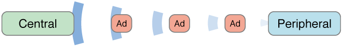

# Bluetooth

# Intro

Nowadays it is very common to have contact with wireless devices. Say a *headphone*, a *mouse*, a keyboard, or the famous *Apple Watch*. The list is long… However, most of them use basically the same technology that makes them indeed *wireless* devices: **Bluetooth®**.

Here we are going to learn briefly the roles and the exchanged properties via a *Bluetooth* connection, and the execution modes using the **Core Bluetooth** *framework*, that gives us the support of using the version 4.0 (*a.k.a smart, a.k.a. low-energy*).

First off, let’s talk about the execution modes, shall we?!

# Execution Modes

**Core Bluetooth**, or CB, gives us two execution modes, *Foreground* and *Background*. This way, we can define if we want our *app* to be “connectable” when only the user is interacting with it or not. Some aspects define properly these modes, they are:

## Foreground

If the app is minimized or another app becomes the primary one used by the user, our *Bluetooth* support goes along. So, in the suspended state, your *app* is not able to perform tasks related to *Bluetooth*, nor is it aware of events related to *Bluetooth*. However, the list of events received while the *app* was in *background* is stacked and these events are delivered when the user resumes the *app*, making it active again.

We will explain below the difference between the roles and the properties, but in this mode if the application is not active, the peripheral can not send advertisements (*advertising*) and the central cannot broadcast its signal (*scanning*), of the execution of *advertising* and *scanning* are answered on demand, virtually without delays.

The advantage of using the *Foreground* mode is that we have all the system resources at our fingertips, such as updating *views* and tasks with no timeout. Still in this mode, our *stack* of devices is well off, even having the option to choose if we want to scan the same peripheral for some specific reason. This is done through a `CBCentralManagerScanOptionAllowDuplicatesKey` property, which is ignored in *Background* mode, just as other properties are treated differently when executed in *Foreground* and *Background* modes and can be found in [References](#references).

## Background

Here we start by saying that system resources are limited. We also have _10 seconds_ maximum to execute a task in this mode. But I think that's more than enough. The runtime of *advertising* and *scanning* may be longer. This is done to save battery power from your device. Here, events from the same device are combined into a single event with their _Services and Characteristics_, that is, the option to scan the same device more than once is discarded. 

The advantage of this mode is that our *app* doesn’t need to be active to exchange data between centrals and peripherals. So, just to clarify, the system wakes up our *app* from a suspended state, allowing you to read, write, subscribe to features, listen to events. All in *background*. But even if we are allowed to run on *background*, our *app* might not be always running. This may happen because eventually the system may terminate our *app* to free up memory for the *app* that is in the active state. From *iOS7*, it is allowed to save device states, pending connections, etc., before an interruption and then restore them afterwards.

As an example for this state restoration, let's imagine that you have developed a security device that communicates with an electronic lock equipped with *Bluetooth*. The *app* and the lock can interact so that the lock locks automatically when the user leaves the house and unlocks when the user returns. All this with the *iPhone* in the pocket. When the user leaves the house, the *iPhone* can eventually get out of reach of the lock and then lose connection. In this case, the user can simply call the function to connect the device even though it is not within range and thus the connection will be redone when they are within range. This happens because the device connection request does not expire.

Now imagine that the user is away from home on a trip. If the *app* is terminated by the system while the user is away, the *app* will not be able to reconnect with the lock when the user returns. So the lock will not unlock. For apps like these, it is definitely necessary to use the save and restore state option.

Note: *macOS* and *iOS* work a little differently on peripheral and central roles. For example, *macOS* does not accept the *flag* `CBCentralManagerOptionRestoreIdentifierKey`, because *macOS* *background* does not end *apps* like *iOS* does, in theory.

To make use of *Background* mode, we still need to define *flags* in `Info.plist`.

- `bluetooth-peripheral`: If we want to use a peripheral in *background* 
- `bluetooth-central`: If we want to use a central in *background* 

If we add support via `Target > Capabilities > Background Modes`, by selecting `Uses Bluetooth LE accessories (central)` and/or `Act as Bluetooth LE accessory (peripheral)`, they are automatically added to `Info.plist`.

**Important**: Do not forget to add the *flag* `Privacy Flag - Bluetooth Peripheral Usage Description` so that the user allows the app to use the device as a peripheral, just as we do when we want to use the camera or location.

# Roles

In this set of Bluetooth connections, we have two distinct, well-specified roles that work as a client-server approach. They are: **Peripheral** and **Central**.

## Peripheral

A peripheral is the device that shares its data with the central. In this mode, the system wakes up our app to process reading, writing, and logging events from the central. This is the device that works as a *Server*, that is, it has the data that is being wanted.

When a peripheral is running in *Background*, its services are reallocated to a special "overflow" area, that is, all *UUIDs* of the services contained in the `CBAdvertisementDataServiceUUIDsKey` property value. Therefore, it can only be discovered by a device that is explicitly scanning by its information, looking for some of its characteristic, basically its identifier.

## Central

A central one is the device that request information from peripheral devices. In this case, it scans, connects, retrieves data, and sends data, scans them. It is the *Client*.

The system wakes up our central when the events of state changing occur with the peripheral, such as connection established or cut with the peripheral, when peripheral updates information of its characteristics, or even when our central is close to being ended and also restored.

### Example

Imagine the functioning of a heart rate monitor of runner. In this case, the peripheral would be the metering device that is located below the runner chest. And an *app* on *iPhone* could read this value and show it to the user in real time, making *iPhone* work as central in an action on *Foreground*. Now imagine that the runner will not want to be looking at your *iPhone* all the time, so in *Background* mode, *iPhone* captures the hear beat data and saves in a *log* where the user can check for variations when his/her workout is finished.


# Connection

The connection between a central and a peripheral is made through scanning and advertisement. Basically this is the flow:

- A peripheral broadcasts a signal that can be connected using advertising packets;
- While the central broadcasts a signal that is searching for peripherals;
- When a central discovers a peripheral, it can first request the connection, which can be rejected by the peripheral or not. This connection can be encrypted with the native encryption that *Core Bluetooth* provides. If the encrypted connection is required, then a code appears on one of the devices to be typed on the other and thus create encryption pairs managed by the system itself, making them trusted devices. If no encryption is required, then the connection is made automatically;
- After the connection is made, the central can then order the peripheral to discover services, basically the central is exploring the peripheral services;
- After discovered services, the central can then order the peripheral to discover characteristics, basically the central is exploring the characteristics of each peripheral service;
- Once the characteristics are discovered, the central can then read values ​​of the characteristics statically or subscribe to that characteristic and if the peripheral updates the its value, the central will be notified with the new value.
- The connection can be terminated, if applicable.



# Services e Characteristics

The data exchanging by connected devices are made through properties and they are services and features already discussed in some topics previously.

A service is a collection of data and associated behaviors to complete a task or function of a device, or parts of a device. These behaviors are called characteristics. A feature provides more detail about a peripheral service. It basically looks like a description of those entries that you look for in a dictionary. One setting takes you to another and you stay in an eternal *loop*. But let's try to explain it better below.

Services may have other related services, such as dependencies, pointing to *UUIDs* of other services. Each characteristic also has *UUID* that it can be identified by.


So in this example we have two sensors that work differently from each other but together they produce a service, which is Heart Rate. For it to work properly, the cardiac sensor must be positioned in the ideal location.

Still using our previous example, suppose that in the device of heart beat we could have two services, one with two characteristics and one with only one:

- Service 1: Heartbeat
     - Feature 1: Heart Rate Measurement
     - Feature 2: Adequate Device Location
- Service 2: Status
     - Feature 1: Battery Level

But a peripheral is nothing if it is not sending advertisements. An advertisement package is relatively a small set of data that has information about the peripheral device for an initial recognition. Data such as device name, *UUID* and *RSSI*, which is information on how strong the peripheral signal is.

# Where are we going?

We will exemplify here the following:

- Roles
     - *iOS* as Peripheral
     - *macOS* as Central
- Modes
     - *Foreground*

To check the *background* mode, check out the [repository of this project in GitHub](https://github.com/LeonardoCardoso/BLE) in the *branch* `background`.

# Code Snippets

Foreground

First, let's create a protocol to receive the events listened from the `BluetoothManager` and update the views of our `ViewController`'s. Let's call it `BlueEar`. And it has one version for `Central` and another for `Peripheral`. Like `BlueEar`, we will have a class that will be the manager of our *Bluetooth* connection and it is the `BluetoothManager`.

### iOS

#### BlueEar

```swift
protocol BlueEar {

    func didStartConfiguration()

    func didStartAdvertising()

    func didSendData()
    func didReceiveData()

}
```

#### BluetoothManager

```swift
class BluetoothManager: NSObject {

    // MARK: - Properties
    let peripheralId: String = "62443cc7-15bc-4136-bf5d-0ad80c459215"
    let serviceUUID: String = "0cdbe648-eed0-11e6-bc64-92361f002671"
    let characteristicUUID: String = "199ab74c-eed0-11E6-BC64-92361F002672"
    let localName: String = "Peripheral - iOS"

    let properties: CBCharacteristicProperties = [.read, .notify, .writeWithoutResponse, .write]
    let permissions: CBAttributePermissions = [.readable, .writeable]

    var bluetoothMessaging: BlueEar?
    var peripheralManager: CBPeripheralManager?

    var serviceCBUUID: CBUUID?
    var characteristicCBUUID: CBUUID?

    var service: CBMutableService?

    var characterisctic: CBMutableCharacteristic?

    // MARK: - Initializers
    convenience init (delegate: BlueEar?) {

        self.init()

        self.bluetoothMessaging = delegate

        guard
            let serviceUUID: UUID = NSUUID(uuidString: self.serviceUUID) as UUID?,
            let characteristicUUID: UUID = NSUUID(uuidString: self.characteristicUUID) as UUID?
            else { return }

        self.serviceCBUUID = CBUUID(nsuuid: serviceUUID)
        self.characteristicCBUUID = CBUUID(nsuuid: characteristicUUID)

        guard
            let serviceCBUUID: CBUUID = self.serviceCBUUID,
            let characteristicCBUUID: CBUUID = self.characteristicCBUUID
            else { return }

        // Configuring service
        self.service = CBMutableService(type: serviceCBUUID, primary: true)

        // Configuring characteristic
        self.characterisctic = CBMutableCharacteristic(type: characteristicCBUUID, properties: self.properties, value: nil, permissions: self.permissions)

        guard let characterisctic: CBCharacteristic = self.characterisctic else { return }

        // Add characterisct to service
        self.service?.characteristics = [characterisctic]

        self.bluetoothMessaging?.didStartConfiguration()

        // Initiate peripheral and start advertising
        self.peripheralManager = CBPeripheralManager(delegate: self, queue: nil, options: nil)

    }

}
```

#### CBPeripheralManagerDelegate

```swift
// MARK: - CBPeripheralManagerDelegate
extension BluetoothManager: CBPeripheralManagerDelegate {

    func peripheralManagerDidUpdateState(_ peripheral: CBPeripheralManager) {

        print("peripheralManagerDidUpdateState")

        if peripheral.state == .poweredOn {

            guard let service: CBMutableService = self.service else { return }

            self.peripheralManager?.removeAllServices()
            self.peripheralManager?.add(service)

        }

    }

    func peripheralManager(_ peripheral: CBPeripheralManager, didAdd service: CBService, error: Error?) {

        print("\ndidAdd service")

        let advertisingData: [String: Any] = [
            CBAdvertisementDataServiceUUIDsKey: [self.service?.uuid],
            CBAdvertisementDataLocalNameKey: "Peripheral - iOS"
        ]
        self.peripheralManager?.stopAdvertising()
        self.peripheralManager?.startAdvertising(advertisingData)

    }

    func peripheralManagerDidStartAdvertising(_ peripheral: CBPeripheralManager, error: Error?) {

        print("peripheralManagerDidStartAdvertising")
        self.bluetoothMessaging?.didStartAdvertising()

    }

    // Listen to dynamic values
    // Called when CBPeripheral .setNotifyValue(true, for: characteristic) is called from the central
    func peripheralManager(_ peripheral: CBPeripheralManager, central: CBCentral, didSubscribeTo characteristic: CBCharacteristic) {

        print("\ndidSubscribeTo characteristic")

        guard let characterisctic: CBMutableCharacteristic = self.characterisctic else { return }

        do {

            // Writing data to characteristics
            let dict: [String: String] = ["Hello": "Darkness"]
            let data: Data = try PropertyListSerialization.data(fromPropertyList: dict, format: .binary, options: 0)

            self.peripheralManager?.updateValue(data, for: characterisctic, onSubscribedCentrals: [central])
            self.bluetoothMessaging?.didSendData()

        } catch let error {

            print(error)

        }

    }

    // Read static values
    // Called when CBPeripheral .readValue(for: characteristic) is called from the central
    func peripheralManager(_ peripheral: CBPeripheralManager, didReceiveRead request: CBATTRequest) {

        print("\ndidReceiveRead request")

        if let uuid: CBUUID = self.characterisctic?.uuid, request.characteristic.uuid == uuid {

            print("Match characteristic for static reading")

        }

    }

    // Called when receiving writing from Central.
    func peripheralManager(_ peripheral: CBPeripheralManager, didReceiveWrite requests: [CBATTRequest]) {

        print("\ndidReceiveWrite requests")

        guard
            let characteristicCBUUID: CBUUID = self.characteristicCBUUID,
            let request: CBATTRequest = requests.filter({ $0.characteristic.uuid == characteristicCBUUID }).first,
            let value: Data = request.value
            else { return }

        // Send response to central if this writing request asks for response [.withResponse]
        print("Sending response: Success")
        self.peripheralManager?.respond(to: request, withResult: .success)

        print("Match characteristic for writing")

        do {

            if let receivedData: [String : String] = try PropertyListSerialization.propertyList(from: value, options: [], format: nil) as? [String: String] {

                print("Written value is: \(receivedData)")
                self.bluetoothMessaging?.didReceiveData()

            } else {

                return

            }

        } catch let error {

            print(error)

        }

    }
    
    func peripheralManager(_ peripheral: CBPeripheralManager, central: CBCentral, didUnsubscribeFrom characteristic: CBCharacteristic) {
        
        print("\ndidUnsubscribeFrom characteristic")
        
        
    }
    
    func peripheralManager(_ peripheral: CBPeripheralManager, willRestoreState dict: [String : Any]) {
        
        print("willRestoreState")
        
    }
    
    func peripheralManagerIsReady(toUpdateSubscribers peripheral: CBPeripheralManager) {
        
        print("peripheralManagerIsReady")
        
    }
    
}
```

#### ViewController

```swift
import UIKit

class ViewController: UIViewController {

    // MARK: - IBOutlet
    @IBOutlet var label: UILabel!

    // MARK: - Life Cycle
    override var preferredStatusBarStyle: UIStatusBarStyle { return .lightContent }

    // MARK: - Properties
    var manager: BluetoothManager?

    override func viewDidAppear(_ animated: Bool) {

        super.viewDidAppear(animated)

        self.manager = BluetoothManager(delegate: self)

    }

}

// MARK: - BlueEar
extension ViewController: BlueEar {

    func didStartConfiguration() { self.label.text = "Start configuration 🎛" }

    func didStartAdvertising() { self.label.text = "Start advertising 📻" }

    func didSendData() { self.label.text = "Did send data ⬆️" }

    func didReceiveData() { self.label.text = "Did received data ⬇️" }
    
}
```

#### View


#### Notes:

- In our example, the Peripheral will start advertising when the `app` is launched.
- You can only do something with the peripheral when the `peripheralManagerDidUpdateState(: CBPeripheralManager)` function is actually called and the peripheral’s state is `.poweredOn`.
- The reading of dynamic values made by the Central through the `.setNotifyValue(true, for: characteristic)` function fires the peripheral’s `peripheralManager(_: CBPeripheralManager, : CBCentral, : CBCharacteristic)` function; on the other hand, the reading of static values made by the Central through the `.readValue(for: characteristic)` function fires peripheral’s `peripheralManager(_: CBPeripheralManager, :CBATTRequest)`.

### macOS

#### BlueEar

```swift
protocol BlueEar {

    func didStartConfiguration()

    func didStartScanningPeripherals()

    func didConnectPeripheral(name: String?)
    func didDisconnectPeripheral(name: String?)

    func didSendData()
    func didReceiveData()

    func didFailConnection()

}
```

#### BluetoothManager

```swift
class BluetoothManager: NSObject {

    // MARK: - Properties
    let serviceUUID: String = "0cdbe648-eed0-11e6-bc64-92361f002671"
    let characteristicUUID: String = "199ab74c-eed0-11e6-bc64-92361f002672"

    var serviceCBUUID: CBUUID?
    var characteristicCBUUID: CBUUID?

    var blueEar: BlueEar?

    var centralManager: CBCentralManager?

    var discoveredPeripheral: CBPeripheral?

    // MARK: - Initializers
    convenience init (delegate: BlueEar) {

        self.init()

        self.blueEar = delegate

        guard
            let serviceUUID: UUID = NSUUID(uuidString: self.serviceUUID) as UUID?,
            let characteristicUUID: UUID = NSUUID(uuidString: self.characteristicUUID) as UUID?
            else { return }

        self.serviceCBUUID = CBUUID(nsuuid: serviceUUID)
        self.characteristicCBUUID = CBUUID(nsuuid: characteristicUUID)

    }

    // MARK: - Functions
    func scan() {

        self.centralManager = CBCentralManager(delegate: self, queue: nil, options: nil)
        self.blueEar?.didStartConfiguration()

    }

}
```

#### CBCentralManagerDelegate

```swift
// MARK: - CBCentralManagerDelegate
extension BluetoothManager: CBCentralManagerDelegate {

    func centralManagerDidUpdateState(_ central: CBCentralManager) {

        print("\ncentralManagerDidUpdateState \(Date())")

        if central.state == .poweredOn {

            guard let serviceCBUUID: CBUUID = self.serviceCBUUID else { return }

            self.blueEar?.didStartScanningPeripherals()
            self.centralManager?.scanForPeripherals(withServices: [serviceCBUUID], options: nil)

        }

    }

    func centralManager(_ central: CBCentralManager, didDiscover peripheral: CBPeripheral, advertisementData: [String : Any], rssi RSSI: NSNumber) {

        // We must keep a reference to the new discovered peripheral, which means we must retain it.
        self.discoveredPeripheral = peripheral

        print("\ndidDiscover:", self.discoveredPeripheral?.name ?? "")

        self.discoveredPeripheral?.delegate = self

        guard let discoveredPeripheral: CBPeripheral = self.discoveredPeripheral else { return }
        self.centralManager?.connect(discoveredPeripheral, options: nil)
        
    }

    func centralManager(_ central: CBCentralManager, didConnect peripheral: CBPeripheral) {

        print("\ndidConnect", self.discoveredPeripheral?.name ?? "")

        self.blueEar?.didConnectPeripheral(name: peripheral.name ?? "")

        guard let serviceCBUUID: CBUUID = self.serviceCBUUID else { return }

        self.discoveredPeripheral?.discoverServices([serviceCBUUID])

    }

    func centralManager(_ central: CBCentralManager, willRestoreState dict: [String : Any]) {

        print("willRestoreState")

    }

    func centralManager(_ central: CBCentralManager, didRetrievePeripherals peripherals: [CBPeripheral]) {

        print("\ndidRetrievePeripherals")


    }

    func centralManager(_ central: CBCentralManager, didFailToConnect peripheral: CBPeripheral, error: Error?) {

        print("\ndidFailToConnect")

        self.blueEar?.didFailConnection()

    }

    func centralManager(_ central: CBCentralManager, didRetrieveConnectedPeripherals peripherals: [CBPeripheral]) {

        print("\ndidRetrieveConnectedPeripherals")


    }

    func centralManager(_ central: CBCentralManager, didDisconnectPeripheral peripheral: CBPeripheral, error: Error?) {

        print("\ndidDisconnectPeripheral", self.discoveredPeripheral?.name ?? "")
        self.blueEar?.didDisconnectPeripheral(name: peripheral.name ?? "")

    }

}
```

#### CBPeripheralDelegate

```swift
// MARK: - CBPeripheralDelegate
extension BluetoothManager: CBPeripheralDelegate {

    func peripheral(_ peripheral: CBPeripheral, didDiscoverServices error: Error?) {

        print("\ndidDiscoverServices")

        if let service: CBService = self.discoveredPeripheral?.services?.filter({ $0.uuid == self.serviceCBUUID }).first {

            guard let characteristicCBUUID: CBUUID = self.characteristicCBUUID else { return }

            self.discoveredPeripheral?.discoverCharacteristics([characteristicCBUUID], for: service)

        }
        
    }

    func peripheral(_ peripheral: CBPeripheral, didWriteValueFor characteristic: CBCharacteristic, error: Error?) {

        print("\ndidWriteValueFor \(Date())")

        // After we write data on peripheral, we disconnect it.
        self.centralManager?.cancelPeripheralConnection(peripheral)

        // We stop scanning.
        self.centralManager?.stopScan()

    }

    func peripheral(_ peripheral: CBPeripheral, didDiscoverCharacteristicsFor service: CBService, error: Error?) {

        print("\ndidDiscoverCharacteristicsFor")

        if let characteristic: CBCharacteristic = service.characteristics?.filter({ $0.uuid == self.characteristicCBUUID }).first {

            print("Matching characteristic")

            // To listen and read dynamic values
            self.discoveredPeripheral?.setNotifyValue(true, for: characteristic)

            // To read static values
            // self.discoveredPeripheral?.readValue(for: characteristic)
            
        }
        
        
    }

    func peripheral(_ peripheral: CBPeripheral, didUpdateValueFor characteristic: CBCharacteristic, error: Error?) {

        print("\ndidUpdateValueFor")

        // We read
        if let value: Data = characteristic.value {

            do {

                let receivedData: [String: String] = try PropertyListSerialization.propertyList(from: value, options: [], format: nil) as! [String: String]

                print("Value read is: \(receivedData)")
                self.blueEar?.didReceiveData()

            } catch let error {

                print(error)

            }

        }

        // We write
        do {

            print("\nWriting on peripheral.")

            let dict: [String: String] = ["Yo": "Lo"]
            let data: Data = try PropertyListSerialization.data(fromPropertyList: dict, format: .binary, options: 0)

            self.discoveredPeripheral?.writeValue(data, for: characteristic, type: .withResponse)
            self.blueEar?.didSendData()
            
        } catch let error {
            
            print(error)
            
        }
        
    }

    func peripheralDidUpdateRSSI(_ peripheral: CBPeripheral, error: Error?) {

        print("\nperipheralDidUpdateRSSI")
        print(self.discoveredPeripheral?.rssi ?? "")
        
    }

    func peripheralDidUpdateName(_ peripheral: CBPeripheral) {

        print("\nperipheralDidUpdateName")

    }

    func peripheral(_ peripheral: CBPeripheral, didWriteValueFor descriptor: CBDescriptor, error: Error?) {

        print("\ndidWriteValueFor")

    }

    func peripheral(_ peripheral: CBPeripheral, didModifyServices invalidatedServices: [CBService]) {

        print("\ndidModifyServices")

    }

    func peripheral(_ peripheral: CBPeripheral, didUpdateValueFor descriptor: CBDescriptor, error: Error?) {

        print("\ndidUpdateValueFor")

    }

    func peripheral(_ peripheral: CBPeripheral, didDiscoverIncludedServicesFor service: CBService, error: Error?) {

        print("\ndidDiscoverIncludedServicesFor")

    }
    
    func peripheral(_ peripheral: CBPeripheral, didDiscoverDescriptorsFor characteristic: CBCharacteristic, error: Error?) {
        
        print("\ndidDiscoverDescriptorsFor")
        
    }
    
    func peripheral(_ peripheral: CBPeripheral, didUpdateNotificationStateFor characteristic: CBCharacteristic, error: Error?) {
        
        print("\ndidUpdateNotificationStateFor")
        
    }
    
}
```

#### ViewController

```swift
import Foundation
import Cocoa

class ViewController: NSViewController {

    // MARK: - IBOutlet
    @IBOutlet weak var label: NSTextField!
    @IBOutlet weak var button: NSButton!

    // MARK: - Properties
    var manager: BluetoothManager?

    // MARK: - Life Cycle
    @IBAction func discover(_ sender: Any) {

        self.manager = BluetoothManager(delegate: self)
        self.manager?.scan()

    }

}

// MARK: - BlueEar
extension ViewController: BlueEar {

    func didStartConfiguration() { self.label.stringValue = "Start configuration 🎛" }

    func didStartScanningPeripherals() { self.label.stringValue = "Start scanning peripherals 👀" }

    func didConnectPeripheral(name: String?) { self.label.stringValue = "Did connect to: \(name ?? "") 🤜🏽🤛🏽" }

    func didDisconnectPeripheral(name: String?) { self.label.stringValue = "Did disconnect: \(name ?? "") 🤜🏽🤚🏽" }

    func didSendData() { self.label.stringValue = "Did send data ⬆️" }

    func didReceiveData() { self.label.stringValue = "Did received data ⬇️" }

    func didFailConnection() { self.label.stringValue = "Connection failed 🤷🏽‍♂️" }
    
}
```

#### View


#### Notes:

- In our example, the Central will start scanning for peripherals when we tap on a button called `Tap`.
- You can only do something with the central when the `centralManagerDidUpdateState(: CBCentralManager)` function is actually called and the central’s state is `.poweredOn`.
- Note that the `CBPeripheralDelegate` is different from `CBPeripheralManagerDelegate` that was used on the peripheral implementation. Both of them are indeed related to the peripheral, but the `CBPeripheralDelegate` allows the central to scan events occurring in the peripheral.
- By opting in on reading the dynamic results, the central subscribes in characteristics of the peripheral, so it is notified if the peripheral changes the characteristic’s value, on which it’s been subscribed to.
- When the central discovers a peripheral, we must create a reference to it, that is, we must retain it by creating a variable that receives this reference.
- The data are transmitted in `Data` format, so you have to transmit whatever you want to that type of data, so it can be correctly received in the other end.

### Result

In the image, we have the respective: *Log* of the peripheral, *iOS*, *macOS*, *Log* of the central.


---- 

### References

- [CoreBluetooth](https://developer.apple.com/library/content/documentation/NetworkingInternetWeb/Conceptual/CoreBluetooth_concepts/AboutCoreBluetooth/Introduction.html)