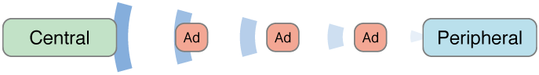

# Intro

É muito comum hoje estarmos em contato com dispositivos sem fio no nosso dia-a-dia. Seja um *headphone*, um *mouse*, um teclado, ou o famigerado *Apple Watch*. A lista é extensa... Todos eles, porém, utilizam basicamente uma mesma tecnologia que os torna de fato *wireless*: **Bluetooth®**.

Aqui vamos aprender brevemente os papeis executados e propriedades difundidas numa conexão via *Bluetooth*, e os modos de execução desses papeis utilizando o *framework* **Core Bluetooth**, que nos dá o suporte à versão 4.0 (*a.k.a smart, a.k.a. low-energy*).

Primeiramente vamos aos modos de execução.

# Modos de Execução

O **Core Bluetooth**, ou CB, nos proporciona dois modos de execução, *Foreground* e *Background*. Assim, podemos definir bem se queremos nossos *apps* "conectáveis" apenas quando o usuário estiver interagindo com ele ou não. Alguns, as aspectos definem bem esses modos, são eles:

## Foreground

Se o app é minimizado ou outro app se torna o principal utilizado pelo usuário, nosso suporte *Bluetooth* vai junto. Assim, no estado suspenso, seu *app* não é capaz de realizar tarefas relacionadas a *Bluetooth*, nem fica ciente de eventos relacionados a *Bluetooth*. Porém a lista de eventos recebidos enquanto o *app* estava em *background* é empilhada e esses eventos são entregues quando o usuário resumir o *app*, tornando-o ativo novamente.

Explicaremos mais abaixo a diferença entre os papeis e as propriedades, mas nesse modo caso o aplicativo não esteja ativo, o periférico não consegue enviar propagandas (*advertising*) e a central não consegue difundir seu sinal (*scanning*), porém a execução de *advertising* e *scanning* são respondidas sob demanda, praticamente sem atrasos.

A vantagem de usarmos em *Foreground* é que temos o todos os recursos do sistema ao nosso alcance, como por exemplo, atualização de *views* e tarefas sem tempo limite de execução. Ainda nesse modo, nossa *stack* de dispositivos é bem distrinchada, inclusive tendo a opção de escolher se queremos escanear o mesmo periférico por alguma razão específica. Isso é feito através de uma propriedade `CBCentralManagerScanOptionAllowDuplicatesKey`, o que no modo *Background* é ignorada, assim como outras propriedades são tratadas diferentes quando executadas em modos *Foreground* e *Background* e elas podem ser achadas nas [Referências](#Referências).

## Background

Aqui já começamos dizendo que os recursos de sistemas são limitados. Temos também _10 segundos_ no máximo para executar uma tarefa nesse modo. Mas creio que isso é mais do que suficiente. O intervalo de execução de *advertising* e *scanning* são podem ser mais demorado. Isso é feito em prol de economizar bateria do seu dispositivo. Aqui, eventos do mesmo dispositivo são combinados num único evento com seus _serviços e características_, ou seja, a opção de escanear o mesmo dispositivo mais de uma vez é descartada.

A vantagem desse modo é permitir que nosso *app* não precisa estar ativo para trocarmos dados entre centrais e periféricos. Então, só para esclarecer, o sistema acorda nosso *app* de um estado suspenso, permitindo ler, escrever, inscrever em características, escutar eventos. Tudo em *background*. Mas mesmo que temos permissão de rodar em *background*, nosso *app* não vai rodar sempre. Isso pode acontecer porque eventualmente o sistema pode finalizar nosso *app* para liberar memória para o *app* que está no estado ativo. A partir do *iOS7*, é permitido salvar os estados dos dispositivos, conexões pendentes, etc., antes de uma interrupção e então restaurá-los depois.

Como um exemplo para essa restauração de estados, vamos imaginar que você tenha desenvolvido um dispositivo de segurança que se comunica com uma fechadura eletrônica equipada com *Bluetooth*. O *app* e a fechadura podem interagir para que a fechadura se tranque automaticamente quando o usuário saia da casa e destranque quando o usuário voltar. Tudo isso com o *iPhone* no bolso. Quando o usuário sair de casa, o *iPhone* pode eventualmente sair do alcance da fechadura e, então, perder conexão. Nesse caso, o usuário pode simplesmente chamar a função para conectar o dispositivo, mesmo não estando no raio de alcance e assim, a conexão será refeita quando eles estiverem de novo ao alcance. Isso acontece porque a requisição de conexão de dispositivos não expira.

Agora imagina que o usuário está fora de casa em uma viagem. Se o *app* é finalizado pelo sistema enquanto o usuário está fora, o *app* não vai ser capaz de se reconectar com a fechadura quando o usuário retornar. Assim, a fechadura não vai destrancar. Para apps como estes, é definitivamente necessário usar a opção de salvamento e restauração de estados.

Observação: *macOS* e *iOS* funcionam um pouco diferente nos papeis de periférico e central. Por exemplo, *macOS* não aceita a *flag* `CBCentralManagerOptionRestoreIdentifierKey`, porque o *background* do *macOS* não finaliza *apps* como o *iOS* faz, em teoria.

Para usar o modo *Background*, precisamos ainda definir *flags* no `Info.plist`.

- `bluetooth-peripheral`: Se quisermos usar um periférico em *background* 
- `bluetooth-central`: Se quisermos usar uma central em *background* 

Se adicionarmos o suporte via `Target > Capabilities > Background Modes`, selecionando `Uses Bluetooth LE accessories (central)` e/ou `Act as Bluetooth LE accessory (peripheral)`, elas são adicionadas automaticamente no `Info.plist`.

**Importante**: Não esqueça de adicionar a *flag* `Privacy - Bluetooth Peripheral Usage Description` para que o usuário permita que esteja utilizando o dispositivo como periférico, assim como fazemos quando queremos utilizar a câmera ou localização.

# Papeis

Nesse jogo de conexões *Bluetooth*, nós temos dois papeis distintos e bem especificados que funcionam como uma abordagem **Client-Server**. São eles: **Periférico** e **Central**.

## Periférico

Um periférico é o dispositivo que compartilha seus dados para a central. Nesse modo, o sistema acorda nosso app para processar tarefas de leitura, escrita, inscrições de eventos vindos da central. É o dispositivo que funciona como *Server*, ou seja, tem os dados que se desejam.

Quando um periférico está sendo executado em *Background*, seus serviços são realocados para uma área de "*overflow*" especial, ou seja, todos os *UUIDs* dos serviços contidos na valor da propriedade `CBAdvertisementDataServiceUUIDsKey`. Sendo assim, ele só pode ser descoberto por um dispositivo que esteja explicitamente escaneando por ele, procurando por alguma de sua característica, basicamente seu indentificador.

## Central

Uma central é o dispositivo que requer informações de dispositivos periféricos. Nesse caso, ela escaneia, connecta, obtém dados e envia dados, os explora.

O sistema acorda nossa central quando eventos de mudança de estado ocorrem com o periférico, tais como conexão estabelecida ou cortada com o periférico, quando periférico atualiza informações de suas caractéristicas, ou ainda quando nossa central está perto de ser finalizada e então restaurada. 

### Exemplo

Imagina o funcionamento de um medidor de batimento cardíaco de praticantes de esportes. Nesse caso, o periférico seria o dispositivo medidor que está alocado abaixo do peito do corredor. E um *app* no *iPhone* poderia ler esse valor e mostrar para o usuário em tempo real, fazendo o *iPhone* funcionar como central, numa ação em *Foreground*. Agora imagina que o corredor não vai querer ficar olhando para seu *iPhone* todo o tempo, então, no modo *Background*, o *iPhone* captura dados dos batimentos e guarda num *log* no qual o usuário pode checar as variações quando terminar seu exercício. 

# Conexão

A conexão entre uma central e um periférico é feita através de escaneamento e propaganda. Basicamente esse é o fluxo:

- Um periférico difunde um sinal que pode ser conectado usando pacotes de propaganda;
- Enquanto a central difunde um sinal que está procurando por periférico;
- Quando uma central encontra um periférico, ele pode explorar primeiro requisitar a conexão, o que pode ser rejeitada pelo periférico ou não. Essa conexão pode ser encriptada com a encriptação nativa que o *Core Bluetooth* nos provê. Se a conexão encriptada for desejada, então um código aparece num dos dispositivos para ser digitado no outro e assim criar pares de criptografia administrados pelo próprio sistema, tornando-os dispositivos confiáveis. Se nenhuma criptografia for requerida, então a conexão é feita automática;
- Após a conexão ser feita, a central pode então ordenar que o periférico descubra serviços, basicamente a central está explorando os serviços do periférico;
- Após serviços descobertos, a central pode então ordenar que o periférico descubra características, basicamente a central está explorando as características de cada serviço do periférico;
- Descobertas as características, a central pode então ler valores das características estaticamente ou se increver naquela característica e caso o periférico atualize o valor dela, a central será notificada com o novo valor.
- A conexão pode ser finalizada, se for o caso.

# Serviços e Características

As trocas de dados feitas por dispositivos conectados são através de propriedades e elas são serviços e características já comentadas em algumas partes anteriormente.

Um serviço é uma coleção de dados e comportamentos associados para completar uma tarefa ou uma função de um disposito, ou partes de um dispositivo. Esses comportamentos são chamados de características. Uma característica provê mais detalhes sobre um serviço de um periférico. Parece basicamente uma descrição daqueles verbetes que você procura em um dicionário. Uma definição te leva pra outra e você fica num eterno *loop*. Mas vamos tentar explicar melhor mais abaixo.

Serviços podem ter outros serviços relacionados, como dependências, apontando para *UUIDs* de outros serviços. Cada característica também tem *UUID* que a possa indentificar.


Então nesse exemplo nós temos dois sensores que funcionam diferentes um do outro mas juntos eles produzem um serviço, que é o Batimento Cardíaco. Para que ele funcione corretamente, o sensor cardíaco deve estar posicionado no local ideal.

Ainda utilizando o nosso exemplo anterior, suponha que no dispositivo de batimento cardíaco poderíamos ter dois serviços, um com duas caracterícticas e outro com apenas uma:

- Serviço 1: Batimentos Cardíacos
    - Característica 1: Medição dos Batimentos Cardíacos
    - Característica 2: Localização Adequada do Dispositivo
- Serviço 2: Status
    - Característica 1: Nível de Bateria

Mas um periférico é nada se não estiver enviando propagandas. Um pacote de propaganda é relativamente um pequeno agrupamento de dados que tem informações sobre o que o dispositivo periférico para um reconhecimento inicial. Dados como nome do dispositivo, *UUID* e *RSSI*, que é uma informação de quão forte é o sinal do periférico.

# Pra onde vamos nós?

Nós vamos aprender duas formas diferentes, então vamos separar do seguinte modo:

* Papeis
    * *iOS* como Periférico
    * *macOS* como Central
* Modos    
    * *Foreground*
    * *Background*

# Code Snippets

## Foreground

### iOS

### macOS

## Background

### iOS

### macOS

---

### Referências

- [CoreBlueetooth](https://developer.apple.com/library/content/documentation/NetworkingInternetWeb/Conceptual/CoreBluetooth_concepts/AboutCoreBluetooth/Introduction.html)

---

### Agradecimentos

Um agradecimento pra galera do [Slack iOS Devs BR](http://iosdevbr.slack.com) pela oportunidade.

Um abraço, e até próxima.

Leo